# Mara Voss Interaction Prompt Pack

This prompt pack extracts the reusable interaction systems from the supplied `Mara Voss Field Recordist Portfolio Template.html`. The reference uses GSAP 3.13, ScrollTrigger, SplitText, Lenis, CSS sticky positioning, variable-font weight, and a small custom-cursor layer.

Use the interaction logic with original identity, copy, colors, imagery, data, and claims. Derive styling from the target project. Keep semantic document order complete before motion runs.

## Source Notes

- Captured at the Codex browser's default desktop viewport: 1376 × 774.
- The original export places its orchestration script in `<head>` and can execute before `.marquee` exists. That traps the page behind its loader and throws from `getBoundingClientRect()`.
- The screenshots were captured from an isolated local copy with one `DOMContentLoaded` guard added before orchestration. The supplied HTML was not modified.
- The page already has useful static/mobile branches. Preserve that progressive-enhancement approach instead of making the animated state the only readable state.

## 1. Signal Acquisition Loader Into a Decoded Hero

> **Core idea** — Open with a restrained signal-acquisition state, then decode the hero rather than simply fading it in. Animate a compact readout and progress rule first. Resolve the display title character by character from compressed, blurred marks; then introduce the echo layer, eyebrow, supporting line, evidence strip, metadata, and scroll cue in reading order.
>
> **Technology** — Use semantic HTML and CSS for the final hero. Use GSAP, Motion One, the Web Animations API, or the project's existing timeline system for the staged reveal. Keep the loader decorative with `aria-hidden="true"`; expose the page title normally to assistive technology.
>
> **Implementation** — Lock scroll only while critical fonts and above-the-fold media prepare. Drive the numeric readout from a plain state object, cap the loader with a failure-safe timeout, and release the page in one idempotent function. Keep the final hero layout fully visible without JavaScript.
>
> **Interaction** — This is an automatic opening sequence, not a click gate. Let repeat visits, reduced motion, slow connections, and restoration from the back-forward cache skip directly to the resolved state.
>
> **Success** — No blank frame, layout jump, double-run, or loader deadlock. The first meaningful content appears quickly; `prefers-reduced-motion` resolves immediately; the timeline stops after settling.

## 2. Split-Door Hero Handoff Into a Contrasting Room

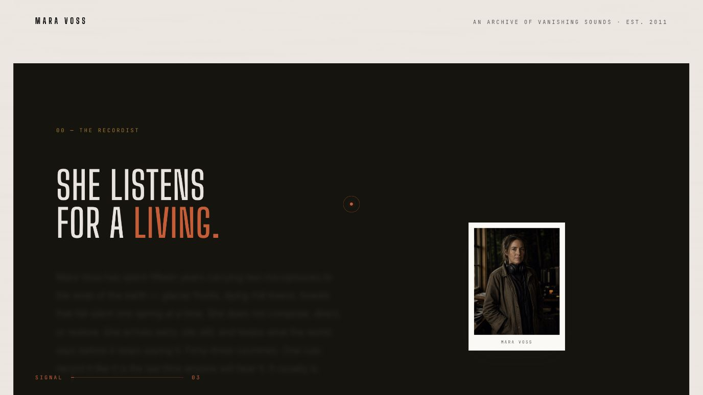

> **Core idea** — Treat the hero surface as two physical doors. As the user leaves the first chapter, fade and lift the hero content, draw a narrow center seam, slide both halves outward, and reveal a contrasting chapter already waiting underneath.
>
> **Technology** — Use two absolutely positioned panels, one seam element, and GSAP ScrollTrigger for a reversible scrubbed timeline. Native `position: sticky` plus a normalized scroll progress value is a good dependency-free alternative.
>
> **Implementation** — Pin the hero only for the handoff distance. Avoid an extra spacer when the following section already occupies the next viewport, and align the timeline end with the natural section boundary. Animate transforms and opacity only; keep the hidden chapter mounted so the reveal never exposes the body background.
>
> **Interaction** — Scroll drives every state in both directions. The content leaves first, the seam appears briefly, the doors part, and the seam disappears once the opening is readable.
>
> **Success** — No white flash, overlap jump, or dead scroll zone. On mobile or reduced motion, replace the split with a direct crossfade or ordinary section transition. Keyboard focus must never remain inside content that has visually left the viewport.

## 3. Pinned Biography With Word-by-Word Illumination

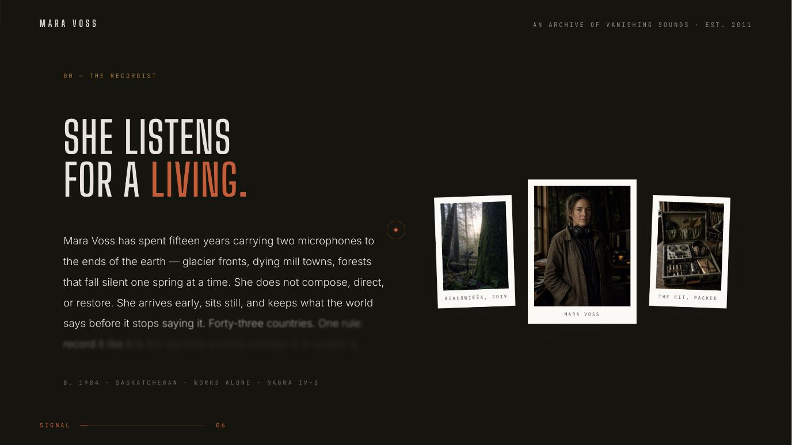

> **Core idea** — Turn a biography into a reading instrument. A dominant portrait resolves first; supporting image plates begin behind it and distribute into a triptych. While the section is pinned, the paragraph moves from soft blur and low opacity to full clarity one word at a time.
>
> **Technology** — Use SplitText only when it is already licensed and available; otherwise wrap words once while preserving the original accessible sentence with `aria-label`. Use ScrollTrigger or a native scroll-progress calculation to map the word index to section progress.
>
> **Implementation** — Measure portrait centers after images and fonts are ready, then animate side plates from the center image to their final grid positions. Mask title lines separately from the paragraph. Reserve one short hold after the final word so the completed composition can be read before unpinning.
>
> **Interaction** — Slow scroll reveals a continuous reading path; reverse scroll dims words in reverse without rearranging text. Touch layouts should use natural flow and a lightweight section reveal instead of a long pin.
>
> **Success** — Text selection, zoom, and screen-reader order remain intact. Never blur large raster layers continuously. Reduced motion renders the full paragraph and final triptych immediately.

## 4. Velocity-Reactive Archive Marquee With a Scrubbed Player

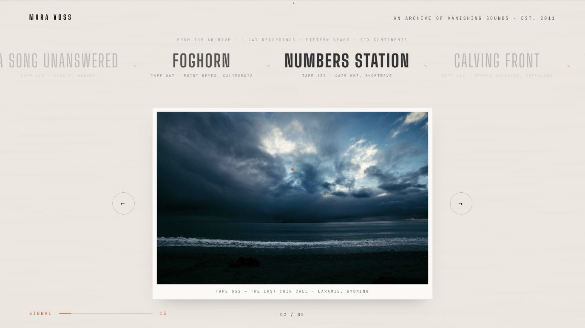

> **Core idea** — Combine a continuous archive feed with a fixed playhead and a pinned media player. The feed moves like tape: scroll direction reverses its travel and scroll velocity briefly accelerates it. Items crossing the center needle gain opacity and variable-font weight. Below, scroll changes one large media record at a time.
>
> **Technology** — Use a duplicated CSS/GSAP marquee track, Lenis velocity only when smooth scrolling already belongs to the project, and one GSAP timeline for player state. A CSS loop plus native scroll velocity sampling is a valid alternative.
>
> **Implementation** — Keep exactly one source of truth for the active player index. Map each item to a normalized timeline segment, overlap outgoing scale-down with incoming scale-in, and update the counter from timeline progress. Arrow buttons must seek the same timeline instead of maintaining separate carousel state.
>
> **Interaction** — Wheel or touch scroll advances records; previous/next buttons land on stable segment midpoints; the center feed item blooms without blocking pointer input.
>
> **Success** — Controls have unique labels, keyboard focus stays visible, cloned handoff content is `aria-hidden`, and autoplay work pauses offscreen. Reduced motion keeps the first record visible with an ordinary accessible list of the rest.

## 5. Full-Screen Chapter Wipe With a Timed Ledger

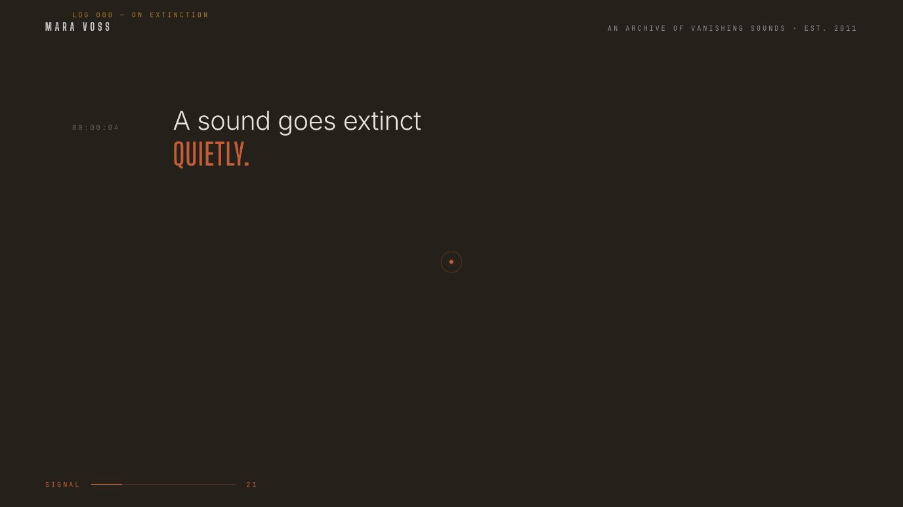

> **Core idea** — Preserve the previous chapter underneath, then sweep a full-screen ink panel across it. Once the panel owns the viewport, reveal a sequence of timestamped lines from masks and bring in small evidence cards while the final lines land.
>
> **Technology** — Use GSAP ScrollTrigger for the pinned chapter and masked line timing. Use CSS `clip-path`, overflow masks, or the Web Animations API when the sequence is short enough to express without a timeline library.
>
> **Implementation** — Clone only the visual final state needed for the handoff, mark the clone `aria-hidden`, and remove its controls from tab order. Keep the live chapter as the only semantic content. Drive panel travel, label, timestamps, line masks, and cards from one normalized timeline with a clear completed hold.
>
> **Interaction** — Scroll brings the panel in, reads the ledger in order, and releases vertically into the next chapter. Reverse scroll restores the previous archive state without flashing or replaying unrelated initialization.
>
> **Success** — The panel never exposes a blank layer. Text is readable without animation, source order matches reading order, and mobile reduces the wipe to a simple section entrance with all lines visible.

## 6. Pinned Asymmetric Counter Index

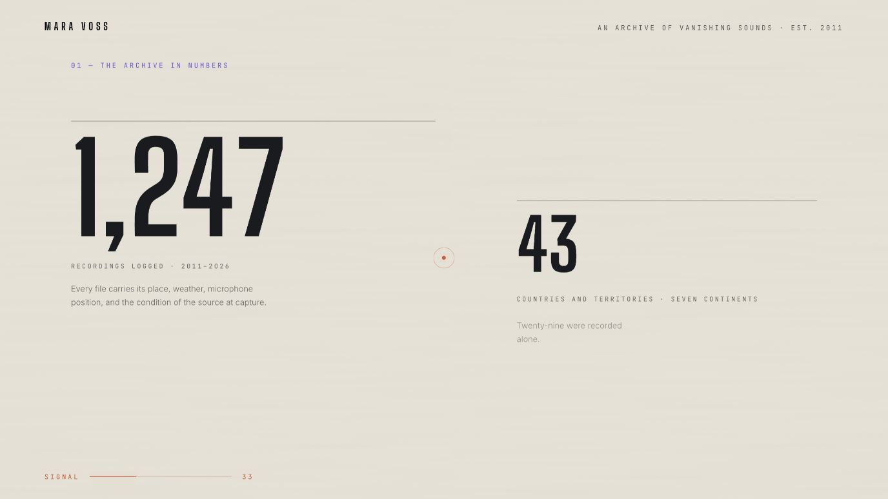

> **Core idea** — Present metrics as an editorial index rather than a grid of identical statistic cards. Give every entry its own scale and column position. During a pinned sequence, draw its rule, unmask the numeral, count to the real value, then resolve metadata and the explanatory note.
>
> **Technology** — Use semantic data elements or headings, CSS Grid for the composition, and a single GSAP or Web Animations timeline. Format display values from numeric `data-*` attributes while keeping the final value available in accessible text.
>
> **Implementation** — Establish one normalized progress track and place entries at irregular beats. Move the inner canvas modestly only when lower entries need room; do not animate layout properties. Resolve the final value exactly, including separators, after every interrupted or reversed animation.
>
> **Interaction** — Scroll pauses the spread long enough for each metric to register. Reverse scroll reverses the reveal without corrupting counters. Mobile abandons the pin and reveals each record as it enters natural vertical flow.
>
> **Success** — Values remain truthful, copy never depends on the animation, 200% zoom does not overlap entries, and reduced motion shows every final metric immediately.

## 7. Sticky Recording Stack With a Weighted Viewing Beat

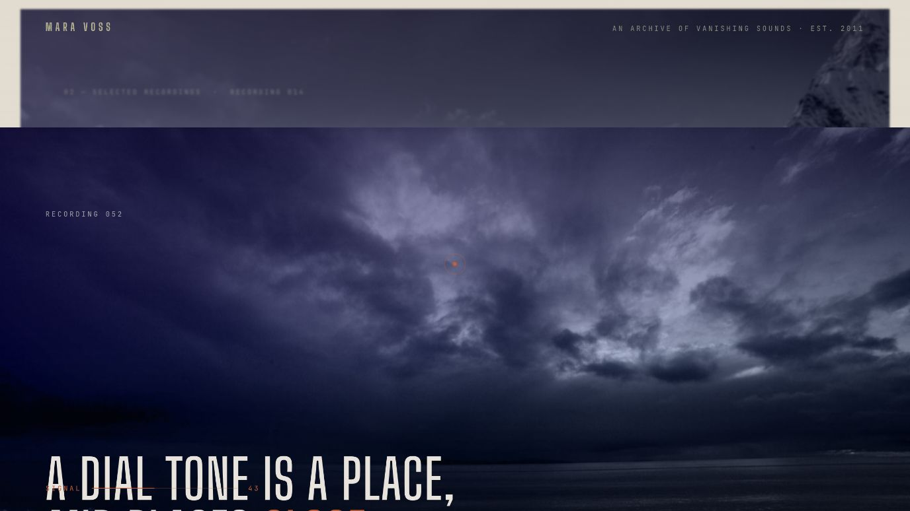

> **Core idea** — Build a sequence of full-viewport media chapters with CSS `position: sticky`. Each new plate rises over the current one. The covered plate scales back, darkens, and softens slightly, creating depth without turning the stack into a 3D spectacle.
>
> **Technology** — Use CSS sticky positioning for the stack and ScrollTrigger only for media crop, masked statement lines, metadata reveal, and outgoing degradation. Avoid JavaScript pinning when native sticky already expresses the layout.
>
> **Implementation** — Reserve media height, decode the current and next images early, and keep each overlay semantic. Give every chapter a brief arrival rest so fast wheel input cannot skip all context, but keep the hold short, cancelable, and disabled on touch devices. Drive the outgoing frame from the next section's approach.
>
> **Interaction** — The incoming chapter covers the current one; the prior frame recedes as the next reaches the top. Reverse scrolling restores the exact previous crop and text state.
>
> **Success** — No scroll trap, image flash, or late color layer. Mobile uses ordinary stacked sections. Reduced motion removes crop zoom, blur, and forced holds while keeping the chapter sequence intact.

## 8. Pinned Catalogue With an Optical Inspection Light

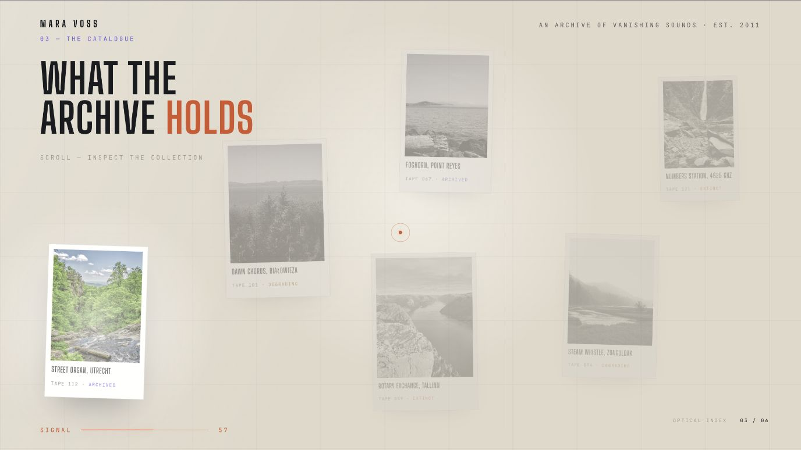

> **Core idea** — Scatter a small collection of mounted records across a light-table canvas. Keep the collection quiet and desaturated, then move one soft inspection light from record to record. The active mount rises, regains color and contrast, and updates an optical index.
>
> **Technology** — Use CSS Grid or absolute placement for the mounts, a radial-gradient element for the light, and one scrubbed GSAP timeline. Prefer CSS filters and transforms over canvas when the content must remain selectable and responsive.
>
> **Implementation** — Measure each card center after layout, then compute light positions at refresh time. Give every record an enter, hold, and release beat; update the counter from the same timeline. Reparent the pinned layer only when a sticky ancestor creates a real compositing conflict.
>
> **Interaction** — Scroll visits each record in a stable order while the rest remain visible as context. The last state restores enough contrast to let the collection read as a whole before release.
>
> **Success** — Avoid filter work on oversized images, cap shadows, and refresh measurements on resize. Mobile becomes a vertical catalogue with per-card reveals. Reduced motion shows all mounts at normal contrast with no moving spotlight.

## 9. Opposing Evidence Plates Into a Paper-to-Black Dissolve

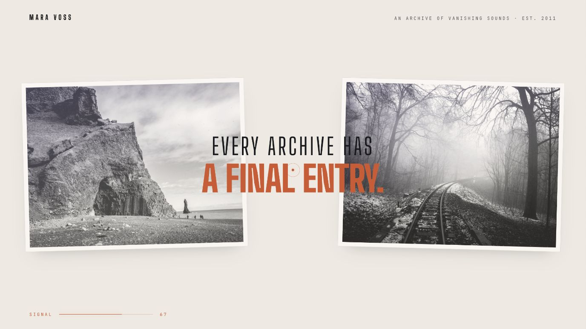

> **Core idea** — Use a short bridge chapter before a tonal shift. Two evidence plates enter from opposite sides while a central statement sharpens. Hold the completed composition, then soften the entire chapter under a black field so the next dark scene feels continuous.
>
> **Technology** — Use one entrance timeline tied to section approach and a second pinned exit timeline. CSS transforms, opacity, blur, and one blackout layer are sufficient; no canvas or page-transition framework is needed.
>
> **Implementation** — Start the entrance before the section reaches the viewport top so the chapter never arrives empty. Keep both images within responsive safe zones and put the statement in normal document order. During exit, reduce scale only slightly, increase blur, and raise the blackout above every paper element.
>
> **Interaction** — Scroll assembles, holds, dissolves, and reverses cleanly. The blackout should become opaque only after the content has begun to soften.
>
> **Success** — The seam into the dark chapter is invisible, contrast remains readable until the intended fade, and reduced motion swaps the paper composition for a direct dark-section transition.

## 10. Dark-Room Image Resolve With a Delayed Verdict

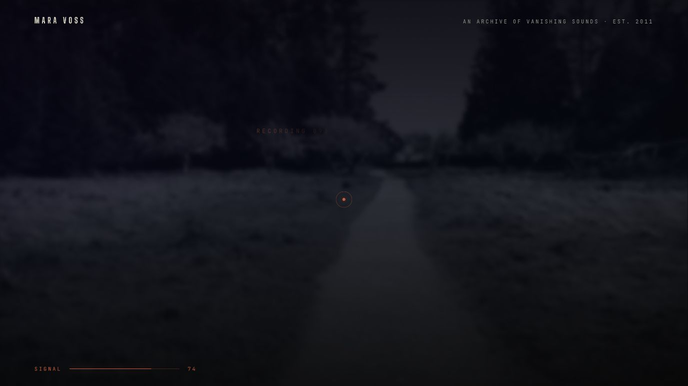

> **Core idea** — Let a low-contrast photograph ghost out of the preceding black field before its chapter pins. Resolve the image slowly, then reveal a short status character by character, followed by a two-stage title and final metadata.
>
> **Technology** — Use CSS for the dark frame and image treatment, plus ScrollTrigger or a native scroll timeline for the ordered reveal. Split only the status and title presentation layers; keep complete accessible text in the DOM.
>
> **Implementation** — Begin the image reveal during section approach, not after the pin starts. Use opacity, a restrained blur, and shallow scale to establish the photograph. Let the first title line land, pause, then reveal the answer line so the copy carries the emotional beat.
>
> **Interaction** — Scroll controls image clarity and the verdict sequence. Reverse scroll returns to the black field without showing unstyled title fragments.
>
> **Success** — Dark imagery maintains text contrast, no large blur runs after settling, and mobile shortens the sequence. Reduced motion presents the resolved image, complete title, and metadata together.

## 11. Pinned Field Log With One Active Record

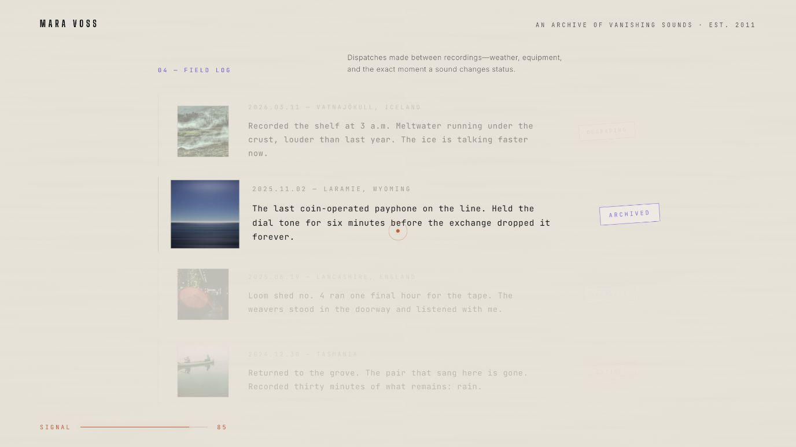

> **Core idea** — Keep a compact field log visible as one editorial sheet. Pin the sheet and move focus through the entries: the current record grows slightly, its thumbnail enlarges, and its stamp becomes legible while completed and upcoming notes remain present at lower contrast.
>
> **Technology** — Use semantic list or article markup, CSS Grid for each row, and one GSAP timeline for active-state transfer. Store all notes in the DOM; never replace entries with a canvas rendering.
>
> **Implementation** — Reveal the first record before the pin catches so the chapter arrives with content. Give each item a short reading hold, then transfer opacity, scale, thumbnail emphasis, and stamp emphasis to the next item from one timeline. Pull the section precisely to its pin only on desktop when weighted scrolling already exists.
>
> **Interaction** — Scroll moves focus forward and backward without hiding context. Keyboard users can tab through links or controls independently of visual focus.
>
> **Success** — Text remains readable at zoom, active emphasis does not shift row geometry, and mobile reveals entries sequentially in natural flow. Reduced motion displays all records at equal emphasis.

## 12. Footer Signal Bloom, Magnetic CTA, Cursor, and Progress Layer

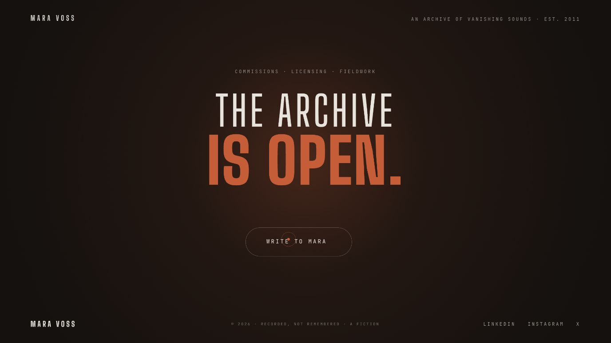

> **Core idea** — Finish with a pinned dark chapter where a soft signal bloom grows behind a two-line verdict. Reveal the primary CTA only after the title is complete. Add a restrained magnetic offset, a tight custom cursor, and a minimal progress meter as one coordinated utility layer.
>
> **Technology** — Use GSAP for the footer timeline and `quickTo` setters for pointer-following transforms. Use a real link or button for the CTA, two fixed pointer elements for the cursor, and a transform-scaled progress rule driven by total scroll progress.
>
> **Implementation** — Map pointer distance from the CTA center to a stronger button offset and a smaller label offset, then ease both back on leave. Keep the magnetic wrapper larger than the visible control. Let the cursor dot react quickly and the trailing ring follow slowly. Fade the global progress meter as the footer takes over.
>
> **Interaction** — Magnetic movement runs only for a fine pointer. Hover and focus share the same visible affordance; the CTA still works as an ordinary semantic control. The progress layer never intercepts input.
>
> **Success** — Disable custom cursor and magnetic movement for coarse pointers and reduced motion. Preserve the system cursor when precision matters, keep visible keyboard focus, stop pointer listeners when the page is hidden, and avoid any footer pin that prevents reaching the document end.

## Shared Build Guardrails

- Initialize motion after the DOM exists. If a script must stay in `<head>`, use `defer` or wait for `DOMContentLoaded` before querying sections.
- Use one scroll conductor. If Lenis is present, synchronize it with ScrollTrigger rather than running competing animation clocks.
- Keep desktop pinning optional. Touch, small screens, reduced motion, failed JavaScript, and restored browser history must all produce a complete page.
- Refresh measurements after fonts and critical media settle, on breakpoint changes, and after dynamic content changes.
- Kill timelines, tickers, observers, and pointer listeners when components unmount or routes change.
- Treat every screenshot here as motion evidence, not a style specification. Replace the reference's name, wording, images, numerical claims, and contact details.
